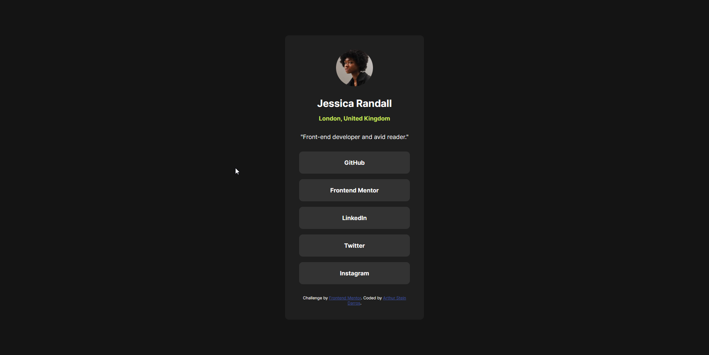
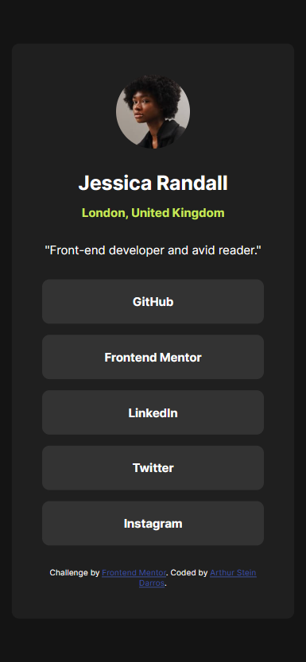

## Table of contents

- [Overview](#overview)
  - [The challenge](#the-challenge)
  - [Screenshot](#screenshot)
  - [Links](#links)
- [My process](#my-process)
  - [Built with](#built-with)
  - [What I learned](#what-i-learned)
- [Author](#author)

## Overview
A challenge made by FrontEnd Mentor to improve skills of HTML and CSS.
### The challenge

Users should be able to:

- See hover and focus states for all interactive elements on the page
- Responsive in mobile and web

### Screenshot

### Links

- Solution URL: [Repository](https://github.com/arthurdarros/social-links-profile-main)
- Live Site URL: [Live Site](https://social-links-profile-main-peach.vercel.app/)

## My process
My process was pretty simple

- I start declaring the tags of HTML and Formatting all the text
- Then i create a file of CSS and Link in HTML file
- I put my browser in mobile view with F12 and start the stylization for mobile
- I follow the order of start with the body and the main container and then go to the texts. And for last the buttons.
- After finished. Some trouble with the version for web, so i created a media query and solve the problem.
- Deploy in GitHub repository
- Deploy site
### Built with

- Semantic HTML5 markup
- CSS custom properties
- Flexbox
- Mobile-first workflow

### What I learned

The most important thing that i learned is how to start the project with the mobile and then go to the web version. 
Other thing as to improve my ability with buttons.

## Author

- Website - [Arthur Stein Darros](https://arthurdarros.github.io/)
- Frontend Mentor - [@arthurdarros](https://www.frontendmentor.io/profile/arthurdarros)

